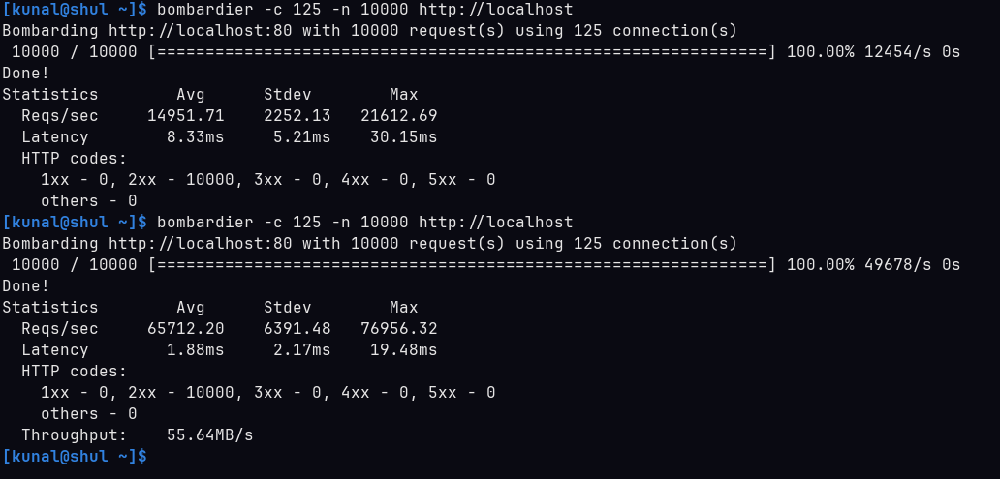

# Minato 🌊

<div align="center">

**Minato is a high-performance, feature-rich reverse proxy and load balancer written in Go with in-memory caching and hot configuration reloads**

[](https://go.dev/)
[](LICENSE)
[](https://go.dev/blog/race-detector)

</div>

# Features

- **High-speed load balancing** with path and domain-based routing
- **In-memory LRU caching** with absolute TTL eviction
- **Health monitoring** of upstream backend servers with automatic Failover and Recovery
- **HTTP cache-control** header support (max-age, no-store, no-cache)
- **Thread-safe** design with no locks in hot request path to upstreams
- A complete custom implementation for `net/http/httputil.ReverseProxy`
- **Streaming-safe** response handling (SSE/chunked)
- **Hot-reloadable** runtime configuration using `SIGHUP` and reuse of state for optimising GC pressure

Minato behaves like a tiny CDN layer embedded into your infrastructure.

### Load Balancing Algorithms

- **Round Robin** - Evenly distribute requests across healthy backends
- **Least Connections** - Route to backend with fewest active connections

### Health Monitoring

- **Dual-Layer Checks** - Fast TCP check followed by HTTP endpoint verification
- **Automatic Failover** - Unhealthy backends automatically removed from rotation
- **Recovery Detection** - Backends automatically restored when healthy
- **Configurable Endpoints** - Per-backend health check URIs

### In-Memory Caching

- **LRU Cache** - Scratch implementation of LRU using Go maps and doubly linked lists
- **Absolute TTL** - TTL based LRU eviction which respects cache-control headers
- **HTTP Cache-Control Aware** - Respects `max-age`, `no-cache`, and `no-store` directives
- **Size-Limited** - Configurable capacity and max response body size prevents memory exhaustion

## 📋 Table of Contents

- [Quick Start](#-quick-start)
- [Installation](#-installation)
- [Configuration](#-configuration)
- [Usage](#-usage)
- [Architecture](#-architecture)
- [Performance](#-performance)
- [Caveats & Limitations](#-caveats--limitations)
- [Development](#-development)
- [Contributing](#-contributing)

## ⚡ Quick Start

1. **Clone the repository**

    ```bash
    git clone https://github.com/kunalvirwal/minato.git
    cd minato
    ```

2. **Configure your services** (edit `config.yaml`)

    ```yaml
    services:
        - name: "my-service"
          listen_port: 80
          balancer: "RoundRobin"
          hosts:
              - "http://example.com/"
          upstreams:
              - host: "http://localhost:8001"
                health_uri: "/health"
              - host: "http://localhost:8002"
                health_uri: "/health"
    ```

3. **Run Minato**

    ```bash
    sudo go run ./cmd
    ```

    Or build and run

    ```
    go build -o minato ./cmd
    sudo ./minato
    ```

4. **Test it**
    ```bash
    curl -H "Host: example.com" http://localhost/
    ```

## 📦 Installation

### Prerequisites

- **Go 1.21+**
- **Root/sudo privileges** - Required for binding to ports < 1024

### From Source

```bash
# Clone repository
git clone https://github.com/kunalvirwal/minato.git
cd minato

# Install dependencies
go mod download

# Build binary
go build -o minato ./cmd

# Run
sudo ./minato
```

## ⚙️ Configuration

Configuration is managed through `config.yaml` in the root directory.

### Configuration File Structure

```yaml
# Cache Configuration (Optional)
cache:
    enabled: true # Enable/disable response caching
    max_body_size: 1048576 # Max cacheable response size (1MB)
    capacity: 100 # Number of global cache entries
    type: "LRU" # Cache eviction policy: "LRU"
    ttl: 300 # Time-to-live in seconds

# Service Definitions (Required)
services:
    - name: "service-name" # Unique service identifier
      listen_port: 80 # Port to listen on
      balancer: "RoundRobin" # Load balancing algorithm

      # Domains/paths this service handles
      hosts:
          - "http://example.com/"
          - "http://example.com/api"

      # Backend servers
      upstreams:
          - host: "http://backend1:8000"
            health_uri: "/health"
          - host: "http://backend2:8000"
            health_uri: "/health"
```

### Configuration Options

#### Cache Settings

| Option          | Type   | Description                                 |
| --------------- | ------ | ------------------------------------------- |
| `enabled`       | bool   | Enable response caching                     |
| `max_body_size` | int    | Maximum response body size to cache (bytes) |
| `capacity`      | int    | Maximum number of cached responses          |
| `type`          | string | Cache eviction policy (`LRU` or `LFU`)      |
| `ttl`           | int    | Cache entry time-to-live (seconds)          |

#### Service Settings

| Option        | Type   | Required | Description                               |
| ------------- | ------ | -------- | ----------------------------------------- |
| `name`        | string | ✅       | Unique service identifier                 |
| `listen_port` | int    | ✅       | Port number to listen on                  |
| `balancer`    | string | ✅       | Load balancing algorithm (`RoundRobin`)   |
| `hosts`       | array  | ✅       | List of domain/path combinations to route |
| `upstreams`   | array  | ✅       | Backend server configurations             |

#### Upstream Settings

| Option       | Type   | Required | Description                        |
| ------------ | ------ | -------- | ---------------------------------- |
| `host`       | string | ✅       | Backend server URL (with protocol) |
| `health_uri` | string | ✅       | Health check endpoint path         |

**Note** : The Upstream[Host] field and Service[hosts] fields allows path to be a part of URLs. So for inbound hosts the largest matching path prefix will be given priority.

### Hot Reload Configuration

Update `config.yaml` and send a `SIGHUP` signal:

```bash
# Find the process ID
sudo ps aux | grep minato

# Send reload signal
sudo kill -1 <PID>
```

**What happens during reload:**

- ✅ New configuration is validated
- ✅ New backend servers are added
- ✅ Older unused backend servers are cleaned up
- ✅ Existing connections continue uninterrupted
- ✅ New listeners start on new ports
- ✅ Old listeners on removed ports shut down gracefully
- ✅ A fresh cache instance replaces the old one.

## 🏗️ Project Structure

```
minato/
├── cmd/
│   ├── main.go           # Entry point, signal handling
│   └── helper.go         # Config building, cleanup
├── internal/
│   ├── backend/          # Backend server abstraction
│   ├── balancer/         # Load balancing algorithms
│   ├── cache/            # Response caching (LRU)
│   ├── config/           # YAML config parsing and global config generation
│   ├── healthcheck/      # Health monitoring
│   ├── proxy/            # Reverse proxy implementation
│   ├── state/            # Global state management and Runtime resource management
│   └── utils/            # Logging utilities
├── Readme_Assets/        # Documentation assets
├── config.yaml           # Main configuration file
├── go.mod
└── README.md
```

## ⚡ Performance Benchmarks with Caching



The benchmark above demonstrates the performance impact of enabling in-memory caching. Testing was conducted with 10,000 requests distributed across 125 concurrent connections to two nginx backend upstreams.

**Key Results:**

| Metric              | Without Cache | With Cache | Improvement         |
| ------------------- | ------------- | ---------- | ------------------- |
| **Average Latency** | 8.33ms        | 1.88ms     | **4.4x faster**     |
| **Requests/Second** | 14,951.71     | 65,712.20  | **4.4x throughput** |

Caching reduced max latency by 35% and increased throughput by 4.4x, making it highly effective for serving cacheable content at scale.

## 🤝 Contributing

Contributions welcome! Please:

1. Fork the repository
2. Create a feature branch (`git checkout -b feature/amazing-feature`)
3. Commit changes (`git commit -m 'Add amazing feature'`)
4. Push to branch (`git push origin feature/amazing-feature`)
5. Open a Pull Request

### Development Guidelines

- ✅ Run `go fmt` before committing
- ✅ Test with `-race` flag
- ✅ Update documentation for new features
- ✅ Add comments for exported functions
- ✅ Keep hot path lock-free

---

## 📄 License

This project is licensed under the MIT License - see the LICENSE file for details.
